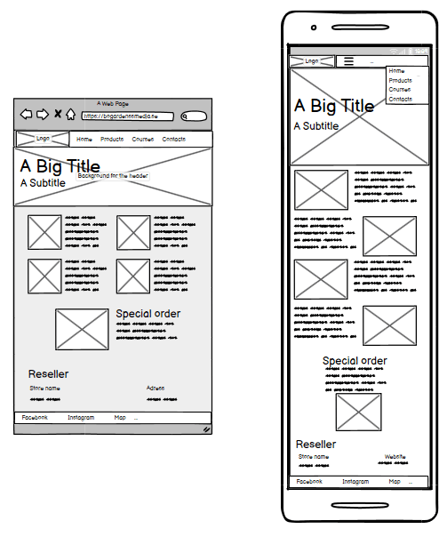

# Bogårdens Blacksmith
Bogårdens Blacksmith is a website created to promote the company Bogårdens Blacksmith and their services and products. Bogårdens Blacksmith is a company that sells smithing items and has courses where people can try backsmithing. The website provides information on where to buy the company’s items and also has a contact form that users can fill out to send their questions, booking requests, and special order requests. View the live site here. View the live site [here](https://ko11e.github.io/Bogardens-blacksmith/).

## Features 

### Site wide
#### Navigation Bar
  - Features liks to the page Home , Products, Contacts and the section Courses that are on the Homepage. The Navigation bar is responsive to all screens
  - Since the navigation section appears on all pages, users can easily navigate through the site on any device.

  

#### The Footer section
  - This section will show the user links to Bogårdens Blacksmith's active social media pages and their location. The links will open in a new tab, making it easy for the user keep exploring their content on the site and socila media.
  - This will allow users to follow Bogårdens Blacksmith on social media, where they can see custom orders and get more up-to-date information than on the website.

  

#### Favicon
  - The website's favicon features the company's logo, which is also displayed in the navigation bar.
  - By adding a favicon with the company's logo, users can easily identify the tab among multiple tabs open.

  

### 404 page
- A 404 page will display if a user navigates to a broken link.
- The 404 error page helps users navigate back to the main website in case of a broken link or missing page, eliminating the need for the browser’s back button.

#### The Hero section
  - The section features an attention-grabbing animation to highlight the site's main content.
  - The photo in the section has a text overlay informing the user of the name of the company and its region of location.

  However, this is not featured on the contacts page, to create a minimalist look and make the focus on the contact form.

### Main page
#### About us section
  - In this section the user gets more information about the company and its history.
  - Its introduces the user to what the company has to offer, as in courses and products.
  - The images in this section showcase the forge and its owner, providing a friendly atmosphere for the user.

### Courses section
  - This section will allow the user to see the four standers cousers that the company has to offer, with a short text explaning the indvidual courses.
  - By hoovering over the image the user gets an infomation that they can send a booking request by a link.  

## Products page
  - The product page will provide the user with some of the products the company has made and can buy. The page is fully responsive make it easy for the user to see the products.
  - This will showcase the company's retail dealer to easily find where they buy the products since this is a static site.
  - A special order example picture is provided along for the user with a link to the contacts form to be able to send a special order request.

 

## Contact page
  - This page provides a platform for users to get in touch with the company. Users can use this page to book a course, request a special order, or ask any other questions they may have. To do so, they will need to fill out a form that includes their full name, email address and the topic of their message. Additionally, there is a message box where users can write their queries in detail.

  - Upon submitting the contact form, the user will be redirected to a success message displayed on the thankyou.html page.

### Existing Features

 All the pages are responsive

### Features Left to Implement

- The current website doesn't allow users to directly book a course, but they can send a request. It would be helpful to add a feature that allows them to view available dates for booking or reservation.

- Another feature to add is when a user clicks on the contact form that is located in the section special orders, the radio button is already selected by default when the user arrive at the contact form. Similarly, when a user clicks on any course from the main page, the radio button for courses and the specific course is also automatically selected.

- Currently, there are only three active sites on the website. Having a dedicated site for courses would make it easier for users to understand the contents of each course.

- By using javascript the contact from send a email to the owner with the input given in the form.

## Design
I started by creating a wireframe, which you can see below. Even though I already had some ideas about the color scheme and images for the website, I have included more detailed information about these choices in the Color and Images section.

### Wireframe
#### Home page

#### Product page

####  Contact page

### Color
Blacksmithing is often considered a mysterious profession, so darker colors are usually preferred for websites related to this field. Looking at other blacksmith websites, it can be observed that a dark color is commonly used. The background color is a dark-brown shade (#3D261F), which is sampled from the apron in the Hero image. The white and orange colors used on the website are chosen using ColorSpace. [ColorSpace](https://mycolor.space/?hex=%233D261F&sub=1).

### Images
- The website features a big banner as a hero image that aims to grab the user's attention right away. The image has a filter that creates a gradient effect, starting from the hammer blows and the sparks, and going up or down to the top or bottom of the picture. This gradient effect is used to make the image more visually appealing and to help the user quickly understand the purpose of the website.

- The images of the products are to give the user a feeling of the skills and precision of the company's work. This applies also in the image to the special order section.

## Technologies

- **HTML**  
 The structure of the Website was developed using HTML as the main language.
- **CSS**  
The website's styling was achieved through the use  CSS, which is located in an external file.
- **Gitpod**  
The website was created by using Gitpod.
- **GitHub**  
The source code is hosted on GitHub and deployed using Git Pages.
- **Git**  
During the development of the website, Git was utilized to commit and push code.
- **Font Awesome**  
Icons from https://fontawesome.com/ are used as social media and map links in the footer.
- **Covertio**  
To convert some images from jpg or png to web format, we used [Convertio](https://convertio.co/jpg-webp/).
- **Tinyjpg**  
Used https://tinyjpg.com/ to compress the size of the images.
- **[Colorspace](https://mycolor.space)**  
To find a color palate for the website colorspace was used.
- **[Favicon.io](https://favicon.io/favicon-converter/)**  
Favicon files were made at 
- **[balsamiq](https://balsamiq.com/wireframes/desktop/#)**  
Used balsamiq to create the wireframes.

## Testing 

  **1. Tested all the pages if they are responsive**  
This text describes how a project's responsiveness is tested by opening it on different devices such as an iPhone, Samsung phone, tablet, laptop, and desktop. The Google Chrome inspect function is also used throughout the project development to ensure responsiveness.

  **2. All the links leading to to other pages internal and external.**  
  The links have been tested on both desktop and mobile devices and are properly directed to the intended site

  **3. Contact from, empty input** 
  When a required field is left empty, an error message appears prompting the user to fill in the empty field.

  **4. Contact form, validat input**  
  Upon submission of the completed form, the user will be redirected to Code Institute confirmation page. After the test, a thank you page has been added that the user to receive after they have submitted the form.
  
### Accessibility

[Wave Accessibility](https://wave.webaim.org/) tool was used throughout development and for final testing of the deployed website to check for any aid accessibility testing.

Testing was focused to ensure the following criteria were met:

- All forms have associated labels or aria-labels so that this is read out on a screen reader to users who tab to form inputs
- Color contrasts meet a minimum ratio as specified in [WCAG 2.1 Contrast Guidelines](https://www.w3.org/WAI/WCAG21/Understanding/contrast-minimum.html)
- Heading levels are not missed or skipped to ensure the importance of content is relayed correctly to the end user
- All content is contained within landmarks to ensure ease of use for assistive technology, allowing the user to navigate by page regions
- All not textual content had alternative text or titles so descriptions are read out to screen readers
- HTML page lang attribute has been set
- Aria properties have been implemented correctly
- WCAG 2.1 Coding best practices being followed

### Validator Testing 

- HTML  
No errors were returned when passing through the official [W3C validator]
  - Home page **[Results](https://validator.w3.org/nu/?doc=https%3A%2F%2Fko11e.github.io%2FBogardens-blacksmith%2F)**
  - Product page **[Results](https://validator.w3.org/nu/?doc=https%3A%2F%2Fko11e.github.io%2FBogardens-blacksmith%2Fproducts.html)**
  - Contact page **[Results](https://validator.w3.org/nu/?doc=https%3A%2F%2Fko11e.github.io%2FBogardens-blacksmith%2Fcontacts.html)**
- CSS  
No errors were found when passing through the official [(Jigsaw) validator]
  - CSS style file 

### Lighthouse testing
  - Home page Results  
Mobile  

Desktop  
  
  - Product page Results  
Mobile  
  
Desktop  
  
  - Contact page Results  
Mobile  
  
Desktop  
  

### Bugs
#### Fixed Buges
- It was difficult to compress many of the received images due to their large size.

- An extra closing < /section > tag was removed from the Products page, which was causing an error that was found when running the W3C validator.

- The form can be submitted by the user without writing a message in the textarea. Although the bug has been fixed, the user can still submit the form by simply entering a dot. I'm unsure if there is a way to fix this issue.

#### Unfixed Buges

No Errors found

## Deployment

The project was published on GitHub Pages by following these steps.
  1. Log in to GitHub and locate the [Repository](https://github.com/Ko11e/Bogardens-blacksmith)
  2. Click on "Settings", located at the end of the menu at the top of the page.
  3. Click on "Page", located in the middle of the menu on the left side.
  4. Under "Branch", click the drop-down called "None" and select "Main".
  5. Click "Save" and refresh the page.
  6. The link to the publish site will shown at the top of the page.

The live link can be found [here](https://ko11e.github.io/Bogardens-blacksmith/) 

## Credits 
- Love Running

The Navigation bar in a mobile view code is taken from the Walkthrough project Love Running at Code Institute. As for the footer both the navbar and footer are modified to fit this project.

The contact form is the HTML code taken but i have added a textarea for the user to write a message.

- Inspiration

I got som of my inspiration from [Gränsfors bruk](https://www.gransforsbruk.com/) 

### Content 

- The text is written by the owner of the company, Fredrik Nordebo

### Media

- The photos used in the hero background is taken [iStock](https://www.istockphoto.com/)
- The background image on the contact page were taken from this other open source site [Stockvault](https://www.stockvault.net/free-photos/blacksmith/).
- The rest of the images was received from Fredrik Nordebo, the owner of Bågordens Blacksmith.

### Acknowledgements

- To my mentor giving good feedback and priority order.

- My family that always listen to all my ideas and give my feedback. 

 
